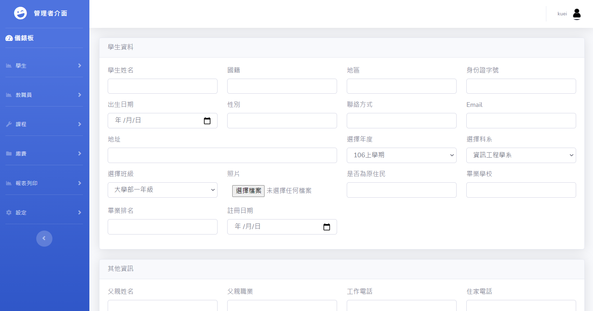
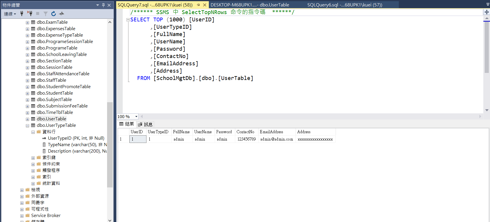

# MVC_SMS
## 簡介
參考線上教學影片School Management System ASP NET MVC C# (Ilyasoft Software Company)練習寫校園資訊系統，主要使用Entity Framework以及asp.net mvc語言，
## 開發環境
1. Visual Studio 2019
2. Microsoft SQL Server Management Studio
## 步驟
1.  在SSMS匯入SQL
2.  建置角色(如圖片)
3.  建置帳號(如圖片，密碼未加密，可自行修改程式)
##### 登入

##### 儀錶板

##### 學生註冊

##### 教師列表

##### 報表列印

##### 資料庫角色

##### 資料庫帳號

## 參考資料
YOUTUBE：School Management System ASP NET MVC C# (Ilyasoft Software Company)